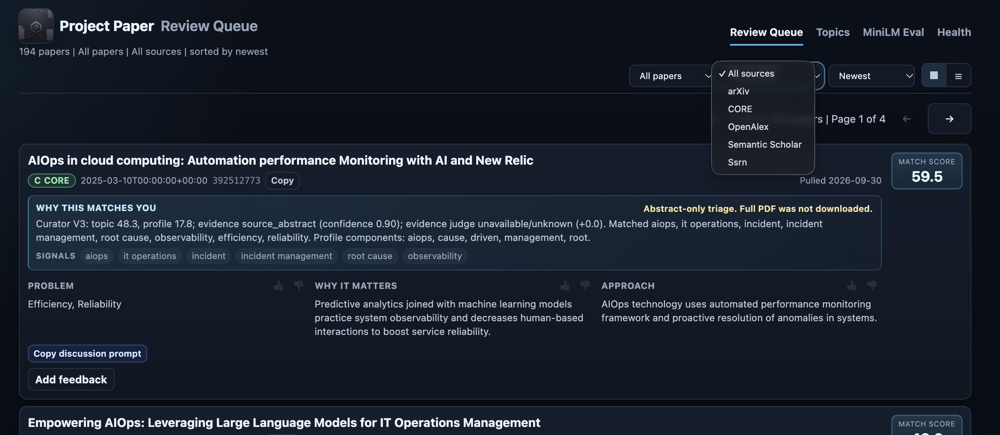

# Project Paper

[](LICENSE)

**A local-first AI research discovery system that finds, ranks, and learns which technical papers are worth your time.**

Project Paper helps technical readers keep up with research without turning paper discovery into an endless search tab. It discovers candidate papers, ranks them against your interests, gives you a compact review queue, and learns from the feedback you save after reading or discussing a paper.

```text
Scout -> Curator -> Review -> Feedback -> Better Recommendations
```



Project Paper is designed around recommendation quality, not collecting the largest possible pile of PDFs. It separates discovery, curation, review, and feedback so each part of the workflow can be inspected and improved.

## What It Does

- Discovers papers from academic sources including arXiv, OpenAlex, and Semantic Scholar.
- Separates retrieval, recommendation scoring, review, and feedback instead of treating the whole process as one opaque ranking step.
- Uses local AI for high-volume paper triage and optional cloud AI for profile synthesis.
- Keeps review history, feedback, topics, and recommendation state local-first.
- Lets you use your preferred external AI or reading workflow for deep paper discussion, then paste the final feedback back into Project Paper.
- Feeds saved feedback into future discovery and recommendation guidance.

## Basic Workflow

1. Configure research topics.
2. Run Scout to discover candidate papers.
3. Curator ranks and explains the strongest matches.
4. Review papers in the Review Queue.
5. Optionally discuss a paper in your preferred external AI or reading workflow.
6. Paste your final feedback back into Project Paper.
7. Future discovery and recommendations use that feedback.

Project Paper is a working local product, not just an AI experiment. The supported Docker Compose path has passed exact-image acceptance on Ubuntu x86-64 and macOS Apple Silicon, with a loopback web UI, persistent local state, local Qwen inference, Review Queue, feedback storage, diagnostics, and packaged backup/restore.

## Current v0.2 Focus

The current v0.2 work is about recommendation quality and the path to a cleaner installable product. Production now combines improved multi-source retrieval, MiniLM interest-fit scoring, and a bounded local Qwen3 Curator judge for the strongest preliminary candidates, while Qwen 2.5 continues to extract the Review Queue's Problem / Why it matters / Approach fields. If the Qwen3 judgment path times out, fails, or returns invalid output, Curator falls back to deterministic scoring instead of treating the model failure as a paper-quality signal.

The public package remains the simple supported starting point described below. v0.2 package acceptance has not yet been run, so richer production capabilities such as Qwen3 Curator judging, optional CORE/Semantic Scholar/OpenAlex credentials, scheduled Mini jobs, and Mini production deployment remain advanced/operator paths until they pass clean public-package acceptance.

## First Supported Path

> **First supported release:** the installer-fronted Docker Compose path and manual in-product Scout have passed exact-image acceptance on Ubuntu x86-64. The same v0.1.3 image also passed macOS Apple Silicon acceptance. See the [package usage guide](docs/m1-package-usage.md), [acceptance report](docs/m1-qa-report.md), and [productization plan](docs/productization-plan.md).

The current first-user path is:

1. Use a fresh clone on Ubuntu x86-64 with Docker Engine and Compose v2, or macOS Apple Silicon with Docker Desktop.
2. Run the installer; its defaults select the public Project Paper image and pinned Ollama image.
3. Open the loopback web UI.
4. Add an enabled arXiv topic in **Topics**.
5. Return to **Review Queue** and choose **Run Scout**.
6. Review returned papers and save feedback. For optional external discussion, copy the discussion prompt and paste the final feedback blob back into Project Paper.

From a clean checkout:

```bash
cd /absolute/path/to/paper-agent
bash scripts/install_project_paper.sh
```

The installer creates `.env` if missing, selects the immutable `v0.1.3` image digest, prepares the default local Qwen model in Docker, starts the app on a loopback URL, and prints runtime/log/retry commands. Docker selects the matching architecture image automatically. The packaged path requires Docker with Compose; it does not require host Python, host Ollama, cron, systemd, OpenAI, Gemini, OpenAlex, or Semantic Scholar credentials for the default arXiv flow.

Gemini profile synthesis is disabled in this package. Feedback blobs are still saved, parsed when possible, and available to deterministic Scout guidance, but direct profile evolution is not promised without the later optional Gemini packaging work.

The packaged runtime stores user state in Compose volumes: `paper-data` for SQLite/artifacts/profile, `paper-config` for topics, and `ollama-data` for the model cache. Re-run the installer to repair/retry without deleting volumes. Do not use `db reset`, remove Compose volumes, or change the recorded project name as a normal recovery or upgrade step.

Use the [packaged backup/restore guide](docs/package-backup.md) to preserve user state and restore into empty volumes with the same image. Upgrade/rollback remains deferred. Support is through [GitHub Issues](https://github.com/devitolo/paper-agent/issues) for the current major version only.

## Requirements and limits

Use Ubuntu x86-64 with Docker Engine and Compose v2, or macOS Apple Silicon with Docker Desktop. Git, network access for image/model downloads and arXiv, and enough Docker storage are required. The installer checks provisional 4 GiB RAM and 6 GiB free-space thresholds; these are preflight guards, not qualified minimum hardware specifications.

Discovery is manual in the package. arXiv can rate-limit requests; local inference can be slow on CPU. Runtime status explains failures and permits retry. Automated scheduling, packaged optional providers, upgrades/rollback, multi-user support, deep reading, Go migration and advanced Topic Agent work remain outside this release scope. Ranking quality is still being validated.

External discussion is a manual handoff. Review the copied content before sending it to a cloud service; local feedback storage does not require a ChatGPT integration.

## Documentation

- [Install, review, diagnostics and recovery](docs/m1-package-usage.md)
- [Backup and restore](docs/package-backup.md)
- [Release acceptance evidence](docs/m1-qa-report.md)
- [Productization scope and remaining gates](docs/productization-plan.md)
- [AI/model stack and v0.2 boundaries](docs/ai-stack.md)
- [Architecture](docs/architecture.md)
- [Mini production container operations](docs/mini-production-operations.md)
- [Native Mini and historical prototype reference](docs/native-operations-history.md)

The Mini production runbook is operator-specific and is not customer setup. The
native reference is archived history from before the 2026-09-24 container
cutover; its old service and provider commands are no longer the active Mini
runtime.

## License

[Apache License 2.0](LICENSE). See [NOTICE](NOTICE) for attribution.
